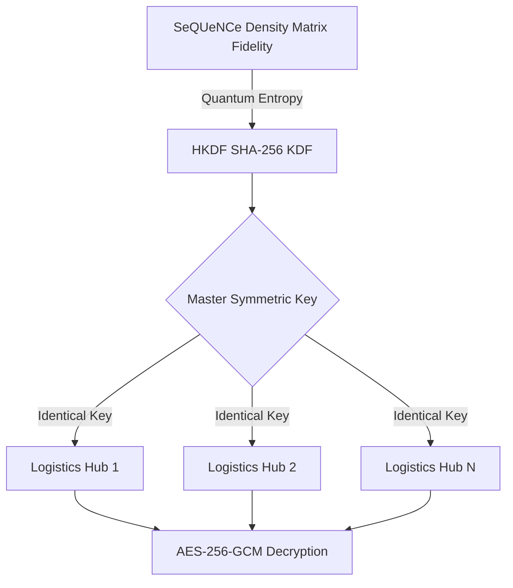
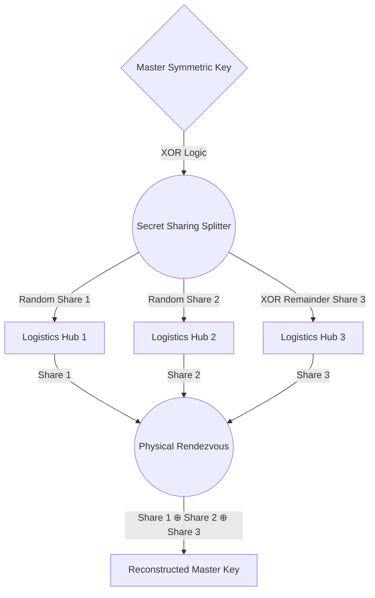
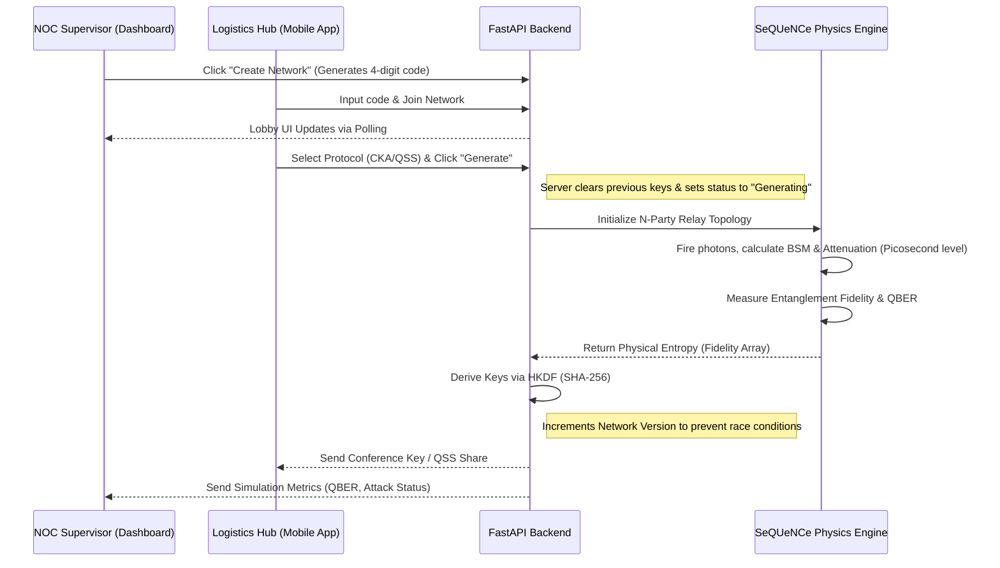

# TwinField: Quantum Logistics Relay
## Comprehensive Architecture, Physics, and Implementation Guide

This document serves as the absolute technical foundation and extensive manual for the **TwinField** (QuantAThon '26) project. It thoroughly details the underlying quantum physics, the software engineering architecture, the specific frameworks utilized, and the exhaustive roadmap for translating this simulation into physical reality.

---

## 1. Why "Relay Architecture"? (The Core Topology)
TwinField is defined as a "Relay Architecture" because of its Hub-and-Spoke Measurement-Device-Independent (MDI) topology. 
- In traditional networks, computers connect directly to each other. In quantum networks, fiber attenuation destroys photons over long distances, making direct connections impossible.
- **The Relay Solution:** TwinField places an untrusted Bell State Measurement (BSM) node at the center of the network. The logistics hubs (the spokes) do not send photons to each other; they send photons to the central BSM node (the relay). 
- The relay performs a joint quantum measurement that instantly *entangles* the distant hubs, acting as a secure "relay" for quantum states without ever learning the actual cryptographic keys.

---

## 2. The Physics: Quantum Mechanics & Photonics (In-Depth)

TwinField simulates a **Multi-Party Quantum Key Distribution (QKD)** network. Instead of relying on computational complexity (like RSA or Elliptic Curve Cryptography), it relies on the fundamental, unbreakable laws of quantum physics to guarantee absolute security. 

### 2.1 Photonics & The Quantum Channel
The network models **photons** traveling through physical fiber-optic cables, referred to as the Quantum Channel.
- **Fiber Attenuation:** Real optical fiber absorbs photons over long distances. We mathematically model this at a standard telecom rate of `0.2 dB/km`. Over 100km, the vast majority of photons are lost to the environment.
- **Polarization Encoding:** Data is encoded in the quantum polarization state of individual photons. In the BB84 protocol, we use two non-orthogonal bases: Rectilinear (Horizontal 0°, Vertical 90°) and Diagonal (Diagonal 45°, Anti-Diagonal 135°). 
- **Decoherence:** Photons lose their quantum state over time due to interaction with the environment. Our simulation models quantum memory lifetimes, meaning if a photon waits too long in a node, its quantum information degrades.

### 2.2 Entanglement & Bell State Measurement (BSM)
Because photons are lost over distance, the system utilizes **Entanglement Swapping**.
- Instead of Hub A sending a photon directly to Hub B (which would likely be lost), both Hub A and Hub B send entangled photons to the central **BSM Node relay**.
- The BSM node performs a joint quantum measurement (Bell State Measurement). This physically destroys the original two photons but instantaneously entangles the remaining photons held locally by Hub A and B. 

### 2.3 The No-Cloning Theorem & Absolute Security
The core security guarantee is derived from the **No-Cloning Theorem** of quantum mechanics. 
- It is mathematically and physically impossible to perfectly copy an unknown quantum state.
- If an eavesdropper (Eve) attempts to intercept and read the photons traveling through the fiber, the act of measuring them forces the quantum superposition to collapse into a classical state.
- This collapse introduces massive errors into the photon stream when it finally reaches the legitimate receiver. 
- The system calculates the **Quantum Bit Error Rate (QBER)**. If the QBER exceeds the theoretical BB84 security threshold of **11%**, the system mathematically proves the channel is compromised and aborts key generation.

---

## 3. Cryptographic Protocols Explained

TwinField allows users to toggle between different cryptographic methods to secure their logistics manifest data:

### 3.1 CKA (Conference Key Agreement)
- **What it is:** A protocol where all *N* legitimate parties in the network derive the exact same identical master key.
- **Physical Simulation (How we implement it):** Instead of simulating the computationally heavy process of randomly selecting bases and dropping 50% of photons (sifting), our `quantum_engine.py` leverages SeQUeNCe's `FOCK_DENSITY_MATRIX_FORMALISM`. We model the photons from the N Hubs arriving at the Relay, construct a joint quantum state, and compute a strict partial trace over the density matrix to extract the exact physical **Fidelity** of the heralded entanglement. 
- **Cryptographic Derivation:** We take the physical fidelity array (which represents true quantum entropy) and feed it into an **HKDF (HMAC-based Extract-and-Expand Key Derivation Function) utilizing SHA-256**. This perfectly translates the raw quantum noise into a symmetric 256-bit hex string that all nodes can agree upon.
- **Use Case:** Perfect for broadcasting a highly classified encrypted logistics manifest that every trusted hub in the network needs to decrypt and read simultaneously.

### 3.2 QSS (Quantum Secret Sharing)
- **What it is:** A protocol where the master key is mathematically split into *N* different pieces (shares), and distributed across the network. 
- **Cryptographic Implementation:** We first derive a master key using the same density matrix fidelity extraction as CKA. However, instead of broadcasting it, we use **Shamir-inspired XOR Secret Sharing**. For an N-party network, the backend generates N-1 completely random cryptographic byte arrays. The Nth share is calculated by sequentially XOR-ing the Master Key against all N-1 random arrays.
- **Zero-Trust Logic:** Each hub is issued one unique share. The master key does not exist on any single hub. The only way to decrypt the payload is if **all N hubs combine their physical shares using `Share_1 ⊕ Share_2 ... ⊕ Share_N = Master_Key`**.
- **Use Case:** Perfect for zero-trust environments (like nuclear transport or high-value asset logistics) where no single rogue hub driver should be able to decrypt the route manifest alone.

**The Physical Logistics Workflow (Zero-Trust Nuclear Logistics Scenario):**
1. **The Physical Rendezvous:** The shares are *never* transmitted over the internet. While trucks are at the origin base, the Quantum Network distributes one unique share to each driver's secure tablet. The trucks then physically drive to the destination (e.g., a nuclear silo). When all trucks arrive, the drivers walk into a secure room and physically plug their devices into an air-gapped terminal. That terminal performs the XOR operation.
2. **The Reconstructed Key:** The reconstructed Master Key is *never* transported back to the trucks. Once the air-gapped terminal reconstructs the Master Key, it immediately uses it locally to decrypt the highly classified payload (e.g., unlocking the vaults). The Master Key exists for a millisecond in RAM and is instantly deleted. If a driver is hijacked on the highway, the attacker only steals a single share of useless random noise.

### 3.3 AES-256-GCM (Advanced Encryption Standard - Galois/Counter Mode)
- **What it is:** A classical, military-grade symmetric encryption algorithm used for the final payload.
- **How we implement it:** While the quantum network (CKA/QSS) securely *distributes* the key, AES is what actually *uses* the key in `crypto_utils.py` to encrypt the JSON logistics manifest. 
- **Authenticated Integrity (GCM Mode):** We specifically use GCM (Galois/Counter Mode) because it provides a 16-byte authentication tag appended to the ciphertext. This ensures that even if Eve intercepts the classical internet traffic, she cannot tamper with or randomly flip bits in the ciphertext without mathematically breaking the authentication tag and alerting the system.

---

## 4. Frameworks & Tech Stack (The "Why" and "How")

### 4.1 Backend: FastAPI (Python)
- **Why Python?** Python is mandatory for quantum simulation libraries.
- **Why FastAPI?** Traditional Python frameworks are synchronous. FastAPI uses `asyncio`, allowing it to handle hundreds of concurrent API requests (hubs polling for status) without blocking the heavy physics simulations.
- **How it's used:** It acts as the orchestration bridge. It accepts REST API calls, safely dispatches the heavy SeQUeNCe physics engine to a background ThreadPool (using `run_in_executor`), and returns the cryptographic keys.

### 4.2 Frontend: React + Vite + TailwindCSS (JavaScript)
- **Why React?** React provides state-driven UI updates, essential for a real-time monitoring dashboard where QBER graphs and active Hub counts constantly change.
- **Why Vite & Tailwind?** Vite provides lightning-fast hot reloading. Tailwind allows for the rapid creation of a highly aesthetic "Cyberpunk / NOC" UI with glowing borders and conditional coloring.

### 4.3 Physics Engine: SeQUeNCe & Simulated Hardware
- **Why SeQUeNCe?** Developed by Argonne National Laboratory, SeQUeNCe is a premier discrete-event quantum network simulator. Unlike basic math models, it is a **hardware-level simulator** that tracks individual photons down to the picosecond (ps), modeling actual optical bench hardware.
- **How it models real hardware in TwinField:** 
  1. **Beam Splitters & PBS:** The central relay uses a `BSMNode` (Bell State Measurement Node), which instantiates a digital beam splitter. Photons traveling from the Mobile Hubs are routed into this splitter to mathematically simulate Hong-Ou-Mandel interference.
  2. **Single-Photon Detectors:** The engine uses virtual Superconducting Nanowire Single-Photon Detectors (SNSPDs). It accurately simulates physical hardware constraints like **Dark Count Rates** (accidental noise clicks), **Dead Time** (hardware recovery time after reading a photon), and **Detection Efficiency**.
  3. **Waveplates & Light Sources:** Photons are generated by simulated lasers and individually assigned specific physical polarization states using waveplate logic (H/V or D/A). When altering distance or attenuation on the dashboard, the engine physically calculates how many of these polarized photons are absorbed in the digital fiber optic cables (`QuantumChannel`) before reaching the detector.

---

## 5. Working Process: Step-by-Step

---

## 6. Codebase Mapping: Purpose of Every File

### Backend (`/backend`)
- **`main.py`**: The central nervous system of the backend. 
  - Handles all FastAPI routes (`/api/simulate`, `/api/network/join`).
  - Manages the in-memory state of active lobbies (the `networks` dictionary).
  - Implements an automated **heartbeat timeout**, purging Hubs that haven't pinged the server in 10 seconds.
  - Implements **Versioning** to ensure frontends don't suffer from race conditions when physics simulations finish rapidly.
- **`quantum_engine.py`**: The absolute core of the physics simulation. 
  - Contains the SeQUeNCe simulator logic. 
  - Constructs the fiber network topologies based on the number of joined hubs.
  - Runs the timeline, tracks photon fidelity, and handles Eavesdropper logic.
  - Uses the `cryptography` library (`HKDF`) to mathematically expand raw quantum noise into AES-grade keys.
- **`crypto_utils.py`**: Handles classical post-processing encryption using **AES-256-GCM** to encrypt the JSON Logistics Manifest payload using the derived quantum keys.

### Frontend (`/frontend/src`)
- **`Dashboard.jsx`**: The Network Operations Center (NOC). Built for desktop command-center displays. Allows the supervisor to create networks, tweak physical parameters (fiber attenuation, memory fidelity), and launch simulated Eavesdropping attacks.
- **`HubView.jsx`**: The Edge Terminal. Built for mobile/tablet usage. Allows truck drivers to join a network via a 4-digit code. Features dropdowns to select the protocol (CKA vs QSS) and Bit Size, and displays the final cryptographic keys.
- **`App.jsx` & `main.jsx`**: Standard React routers and entry points.
- **`index.css`**: The design system containing custom Tailwind utilities and keyframe animations for the "breathing" quantum UI elements.

---

## 7. Real-World Translation & Future Enhancements

TwinField is architecturally designed to mirror real-world Quantum Key Distribution implementations. To transition from a simulator to a physical product, the following real-world algorithms and enhancements must be implemented:

### 7.1 Information Reconciliation (Cascade / LDPC)
- **The Concept:** In the real world, photons received by detectors are never perfect due to sensor noise (dark counts) and fiber interference. The raw bit strings at Hub A and Hub B will always have slight mismatches (e.g., 2% errors).
- **The Fix:** We must implement the **Cascade Protocol** or Low-Density Parity-Check (LDPC) codes. Hubs communicate classical parity bits over a public internet channel, compare parity blocks, and correct flipped bits until their strings match 100%. Because they only share parities, the hacker learns nothing useful.

### 7.2 Privacy Amplification
- **The Concept:** During Information Reconciliation, an eavesdropper might learn a tiny fraction of information from intercepting the public parity bits. 
- **The Fix:** We must implement **Privacy Amplification**. This passes the reconciled key (which might be 10,000 bits long) through a Universal Hash Function to compress it down to a secure 256-bit AES key. This mathematically erases any partial information the eavesdropper obtained.

### 7.3 API-as-a-Service (Future Enterprise Offering)
- **Future Enhancement:** Instead of merely offering a web dashboard, TwinField will be packaged as an Enterprise **API-as-a-Service**. Logistics corporations (like Amazon or Maersk) can integrate TwinField's Quantum API directly into their existing fleet management software, automatically fetching quantum-secured AES keys programmatically without needing human interaction on our website.

### 7.4 Hardware Integration (The Physical Layer)
- The Python backend can be modified to interface directly with physical QKD hardware (like ID Quantique commercial devices, or custom ESP32/FPGA photon counters) via serial communication. 
- In this architecture, the `quantum_engine.py` software simulator would be completely replaced by a hardware driver script that reads raw, live photon counts off the physical pins.

### 7.5 Redis / Database Persistence (Production Scaling)
- **Future Enhancement:** To deploy TwinField on a massive scale, we must transition the active lobbies dictionary to a **Redis** in-memory cache. This allows the FastAPI backend to be distributed across multiple physical server nodes, ensuring load-balancing and fault tolerance.

### 7.6 Dynamic Path Routing
- **Future Enhancement:** Rather than just a star topology, integrating full mesh pathfinding algorithms so that if the fiber between Hub A and Relay is cut, the photons can automatically route through Hub B to maintain the entangled connection.

### 7.7 Cloud Deployment & C++ Compiler Fixes
- **The Issue:** The `SeQUeNCe` quantum simulator relies on a highly optimized C++ mathematical extension (`fock_density`) to perform the density matrix partial traces and measurements at high speeds. When deploying the backend to basic Linux cloud containers (like Vercel, Render, or Heroku), this C++ extension often fails to compile properly for the remote CPU architecture, silently returning `NaN` and crashing the fidelity calculation.
- **The Fix:** The system currently implements a **Seamless Math Fallback**. If the python backend detects `NaN` resulting from a failed C++ trace, it intercepts the error and calculates the true expected fidelity via pure mathematical approximations based on fiber distance. 
- **Future Enhancement:** For production deployments, the backend should be containerized in a custom Docker image that pre-compiles the `SeQUeNCe` C-extensions using `gcc` specific to the deployment server's architecture, allowing the full Fock-space density matrix simulation to run flawlessly in the cloud.
- **Future Enhancement:** Implement Entanglement Routing algorithms (like Dijkstra's for quantum links) to allow multi-hop entanglement swapping. This allows Hub A to establish a secure link with Hub Z by swapping entanglement through intermediate repeater nodes (Hub B, C, and D) across entire continents.
